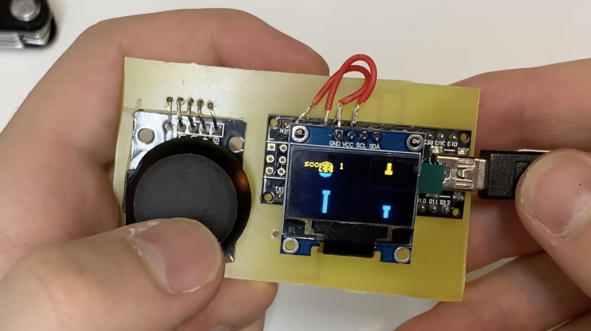
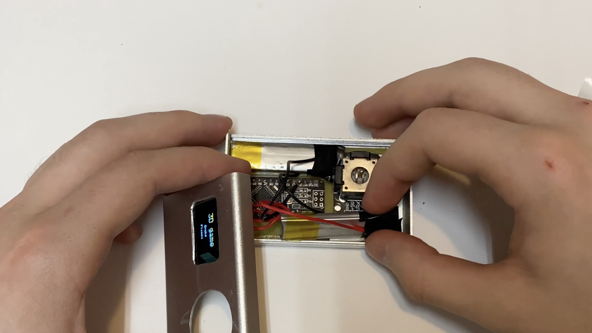
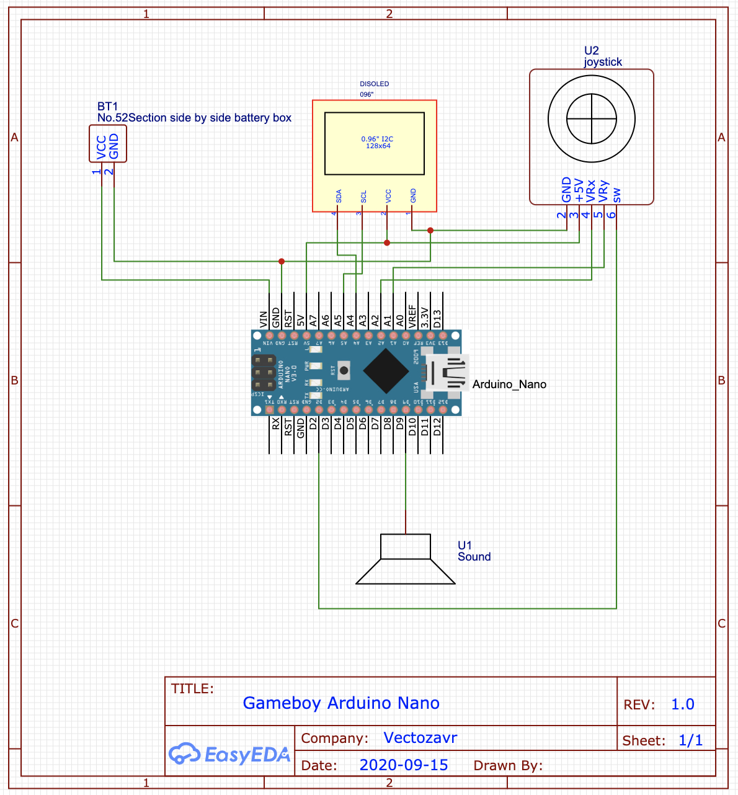

# GameBoy_arduino
Source code of gameBoy from video on YouTube channel "Vectozavr"

This project can be run on any arduino platforms:

This project contains 3 simple games. You can switch between them by menu:

You can modify any games and make them more beautiful!

Gameboy:

Gameboy inside:

Scheme for this code:

If you want to make the same configuration:

